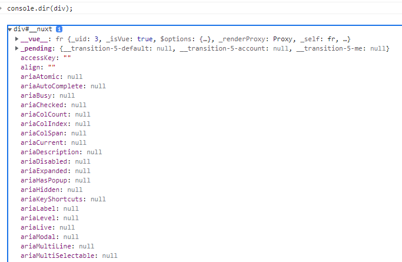

# DOM (The Document Object Model, 문서 객체 모델)

HTML은 문서이다.
DOM은 HTML, SVG, XML 객체를 문서로 모델링하는 것을 의미한다.
이는 Javascript의 일부가 아니라 Javascript로 HTML을 모델링 해서 표현하는 방법이라고 볼 수 있다.
DOM은 문서의 구조화된 표현(structured representation)을 제공하며
프로그래밍 언어가 DOM구조에 접근할 수 있는 방법을 제공하여 그들이 문서 구조, 스타일 내용 등을 변경할 수 있게 돕는다.

- HTML => 문서
- 문서를 조작하는 언어 => Javascript
- Document Object Model <- Javascript (Javascript로 DOM을 이용해 HTML을 조작)
- Node -> DOM의 구성 단위이며, NODE는 Tree 형태로 구성됨

### 정리!

**DOM은 HTML 문서를 Javascript로 모델링한 것이며, DOM interface의 가장 작은 단위는 Node이고 Node는 Tree 구조로 구성됨**

<hr>

## DOM 속성

```
document.querySelector('html 태그');
```

위와 같이 javascript의 querySelector로 특정 html요소를 가져올 경우,
해당 DOM 객체 내부에는 아래와 같이 수많은 DOM 속성들이 존재한다.


<hr>

## DOM 선택

- Document.getElementById() : id로 가져옴
- Element.getElementsByClassName() : 클래스명으로 가져옴
- Document.getElementsByTagName() : 태그로 가져옴

==> 위 세가지를 동시에 사용할 수 있는

- Document.querySelector()
- Documnet.querySelectorAll()
  <br>
  => id, class, tag 모두 가져올 수 있음

<hr>

## DOM 조작

DOM을 조작하는 방법은 매우 많은데 아래와 같은 예시처럼 사용할 수 있다.

```
클래스 name 추가하고 조작하기
const btn = document.querySelector(element);
btn.classList.add('new-class'); //'new-class' 추가
btn.ClassList.remove('new-class'); //'new-class' 지우기
btn.classList.contains('new-class'); //'new-class'를 포함하고 있는지 확인

텍스트 변경하기
const txt = document.querySelector(element);
txt.textContent
txt.textContent = 'new text';

DOM 노드 추가 및 지우기
const box = document.querySelector(element);
const el = document.querySelector(element);
box.removeChild(el);
const el2 = document.createElement(element);
el2.textContent = 'NEW';
box.appendChild(el2);

DOM 내부 HTML 통째로 변경하기
box.innerHTML = '<h1 class="element">some text</h1>';
```
