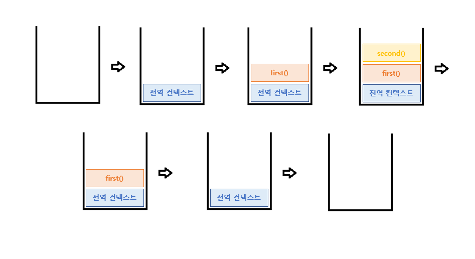

<h1> 자바 스크립트 실행 컨텍스트 </h1>

실행 컨텍스트(Execution context)는 실행할 코드에 제공할 환경 정보들을 모아놓은 객체로, javascript 가 동작하는 원리 중 가장 핵심.
Javascript 가 실행되는 방식을 담고 있는 핵심 원리를 알아보자

Javascript 엔진이 코드를 읽고 **실행에 필요한 정보를 모아놓는 것**
실행에 필요한 정보를 종류와 단계에 따라 구분함
실행에 필요한 환경 정보들을 모아 컨텍스트를 구성하고, 이를 call stack에 쌓아올렸다가, 가장 위에 쌓여있는 컨텍스트와 관련 있는 코드들을 실행하는 식으로 전체 코드와 환경과 순서를 보장한다.

실행컨텍스트의 종류는

1. <b>Gloabl - 전역 (GEC)</b> </br>
   전역 공간. this, 객체 바인딩, 변수 선언
2. <b>Function - 함수 (FEC)</b> </br>
   상위 컨텍스트, this, 매개변수, arg..
3. Eval - eval 메서드

이렇게 세 가지가 있다

#### 실행 컨텍스트의 단계

생성 단계 : JS 엔진이 함수를 호출했지만 실행이 시작되지 않은 단계

1. 전역 객체 생성
2. 변수 생성
3. 변수는 undefined로 초기화 (hoisting)
4. 함수는 메모리에 위치

```
var name = 'joy';

function hello() {
  console.log(this.name);
  console.log(name);
}
```

실행 단계 : 전역변수의 값 할당이 발생하며 코드를 실행하는 단계

1. 함수 호출 시 함수 실행 컨텍스트 생성
2. arguments 접근 가능
3. GEC에서 생성된 환경에 접근가능 (전역공간)
4. 만약 함수가 다른 함수 호출 시 새로운 함수의 실행 컨텍스트 생성되며 반복

```
var name = 'joy';

function second() {
  console.log('두번째);
}

function first() {
  second();
  console.log(this.name);
  console.log(name);
}

first();
```

위 코드를 그림으로 확인해 보자


## 정리!

- 함수는 call stack으로 호출 및 종료된다.
- 전역 컨텍스트에서 함수 컨텍스트가 실행이 되고
  함수 컨텍스트는 call stack에 생성되며, scope chain 이 일어날 수 있다.
- 함수에 필요한 parameter인 arguments 들도 함수가 생성되고 실행될 때 환경에 대한 초기화가 일어나고 실행이 된다.
- 생성단계에는 전역공간에 필요한 것들과 (this, window객체) 변수 호이스팅이 일어난다.
